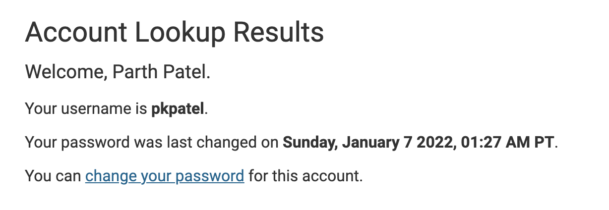

## Installing VScode

If you already have Visual Studio Code installed on your computer, you can skip this step. Otherwise, you can download the version of Visual Studio Code that is appropriate for your operating system from [visual studio code](https://code.visualstudio.com/).
Once you have Visual Studio Code installed, open a new window and drag in a folder that you want to use for this lab; then, click new terminal (command +) so you can do the ssh. This setup should look something like this.

## Remotely Connecting

In order to ssh into a course specific account on ieng6, you need to go to [this link](https://sdacs.ucsd.edu/~icc/index.php). Here you will find your course specific account number and can set a password for it by clicking on “reset password”.

Once you have reset the password and have the course specific account, enter the following command replacing the cse15lwi22axt with your own course id:
`ssh cs15lwi22axt@ieng6.ucsd.edu`
Enter the password you set previously. If it gives you a yes/no prompt, type yes and enter. It should look like this.

## Trying Some Commands

You can try different commands on this ssh window such as `cd` (current directory), `ls` (list), different variants of `ls` like `ls -a` (list all), `cp` (copy), `cat` (print file contents). You can essentially treat this as a regular terminal that just runs on another computer.

## Moving Files with scp

Create a file so that you can copy it over to the ieng6 computer with ssh. On the client side, enter the following into the terminal where <fileName> should be the file you just made. 
`scp <fileName> cs15lwi22axt@ieng6.ucsd.edu:~/`
Make sure that you are in the same directory as the file you made in the terminal, otherwise it will not work. It will prompt you to enter a password, and once you have done this, you can ssh back into the remote server and see that your file is there in the remote server’s home directory. 

## Setting an SSH Key

Notice that when I did the scp in the previous step, it did not ask me for my password. This is because I already had an ssh key set up. It is more convenient to have this set up so you don’t have to constantly put in your password. In order to set this up type `ssh-keygen` on the client, `mkdir .ssh` on the server, and lastly `scp /Users/parth4apple/.ssh/id_rsa.pub cs15lwi22axt@ieng6.ucsd.edu:~/.ssh/authorized_keys` on the client.
This should yield the following.

(I did not have to type `mkdir .ssh` on the server because it already existed)

## Optimizing Remote Running
Sometimes you just need to run a command or two on the terminal and you don’t necessarily need to go through the entire server terminal interface. To save time in this case, you can type 
`ssh cs15lwi22axt@ieng6.ucsd.edu “command 1; command 2; command 3”`
This will execute all the commands you pass in on the remote server and then return to the client. A demonstration of this is shown below.

