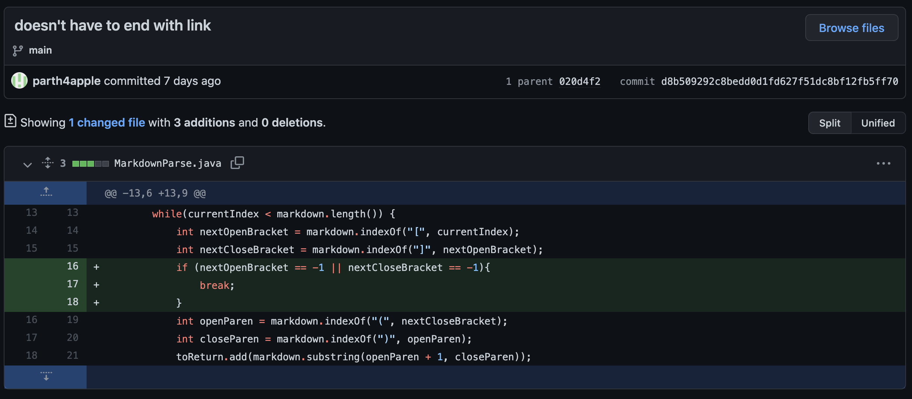
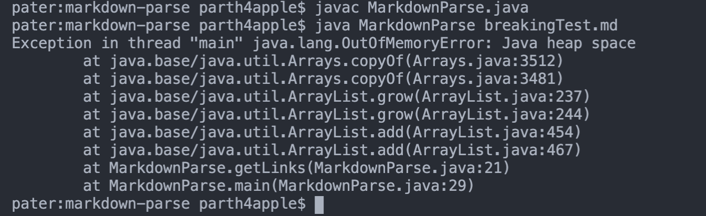
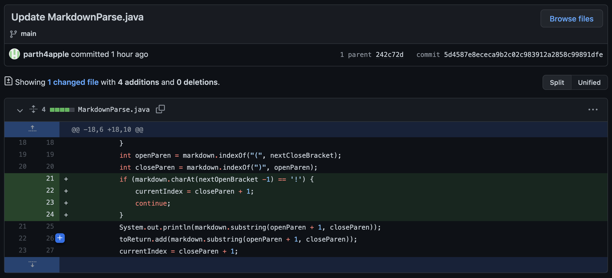
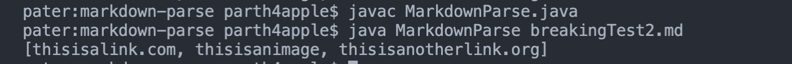
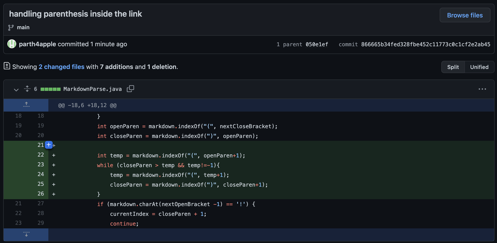
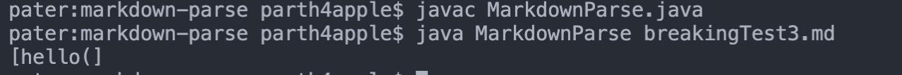

Show a screenshot of the code change diff from Github (a page like this)
Link to the test file for a failure-inducing input that prompted you to make that change
Show the symptom of that failure-inducing input by showing the output of running the file at the command line for the version where it was failing (this should also be in the commit message history)
Write 2-3 sentences describing the relationship between the bug, the symptom, and the failure-inducing input.

## Code Change #1: 1 link file does not end with a link
Git diff for this change:

Link to test file that caused problems:
[breakingTest.md](https://github.com/parth4apple/markdown-parse/blob/main/breakingTest.md)

Symptom of this failure inducing input is that the program runs for a while and then gives the `java.lang.OutOfMemoryError` as the output. 

The bug in this program is that the while loop only stops when `currentIndex >= markdown.length()`. When the file does not end with a link, `currentIndex` will always be less than `markdown.length()`, meaning the while loop continuously adds the last link to the arrayList. This bug leads to the symptom of running out of heap space, since the amount of times we add the last link to the arrayList is too large. The other symptom of the program, running for longer than expected, is also due to the bug of a non-terminating loop. 

Note: this also fixes another major failure inducing input: an empty file.

## Code Change #2: Images are read in as links
Git diff for this change:

Link to the test file that caused problems:
[breakingTest2.md](https://github.com/parth4apple/markdown-parse/blob/main/breakingTest2.md?plain=1)

The symptom of this failure inducing input is that the program interprets markdown image tags as links as well, yielding image paths in the returned link arrayList.

In markdown, image tags behave similarly to link tags. You have `` in both of them, the difference is, image tags have a `!` in front: ``. The bug is that our program is just looking for brackets and parenthesis and ignoring `!` in front of these brackets. This bug leads to the symptom of image references showing up in our link array that we are printing out, when they should not be there.

## Code Change #3: Corner Case of link at start of file
Git diff for this change:

Link to the test file that caused problems:
[breakingTest3.md](https://github.com/parth4apple/markdown-parse/blob/main/breakingTest3.md?plain=1)

The symptom of this failure inducing input is that the program only outputs the link until the first close parenthesis rather than the end of the link. For example, the link `hello()(()).com` would just be output as `hello(`, which is incorrect.

Though the program runs as we defined it, the bug in the program is that it does not properly parse the link until its actual termination. It just takes the substring until the next close parenthesis, which will not always work. As a result of this implied bug, we run into the symptom of getting an incorrect link when given the failure inducing input of a link containing multiple parenthesis.