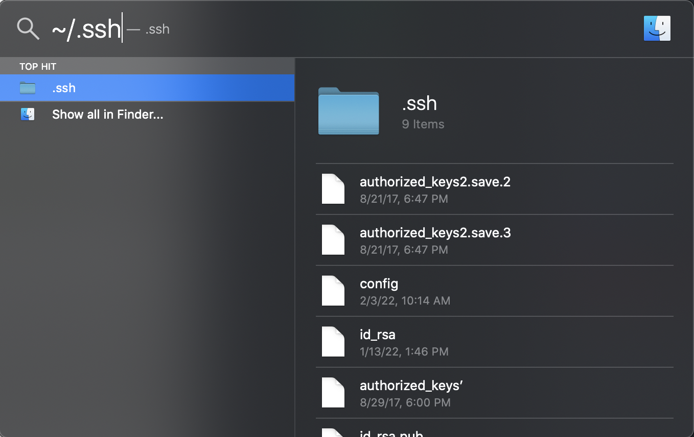
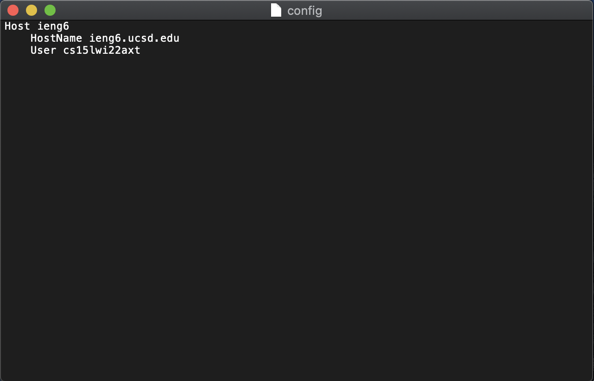
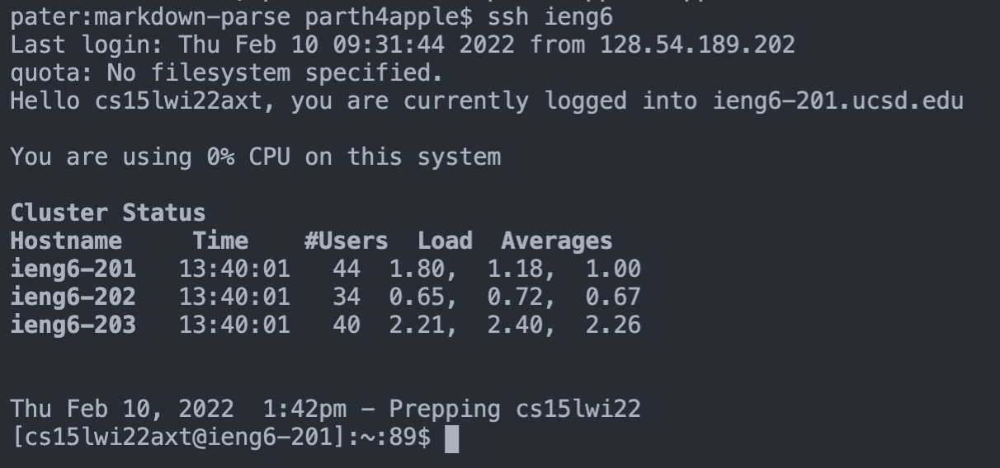
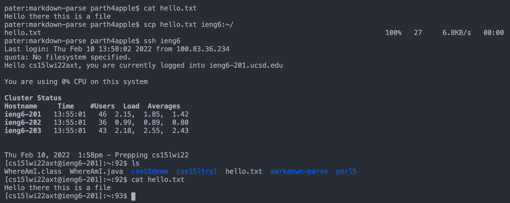

# Streamlining ssh Configuration

### `.ssh/config` file set up
In order to set up the config file in my local computer's ssh file, I typed `~/.ssh` into the mac spotlight search in order to find the ssh folder on my computer. 

After finding and opening it, I created a new file called config using TextEdit and copy pasted the items from the week 5 lab report. The resulting file is shown below. I dragged this file into the `.ssh` folder I had open

### Logging into ieng6 with ssh alias command
As I defined in my config file on my computer, I typed `ssh ieng6` into the terminal and it yielded a login into the remote server. I did not need to put in my password in this case because I have a keygen set up. 

### Showing an scp command runnning
I created a file called `hello.txt` that just has some text content (shown with `cat hello.txt`). I then used the command `scp hello.txt ieng6:~/` on my computer from the directory that contained `hello.txt`. After this, I logged into ieng6 using `ssh ieng6`, and double checked that the file `hello.txt` was present there. I ran `cat hello.txt` on the remote server just to see that it matches up with the file contents that should be present. 
