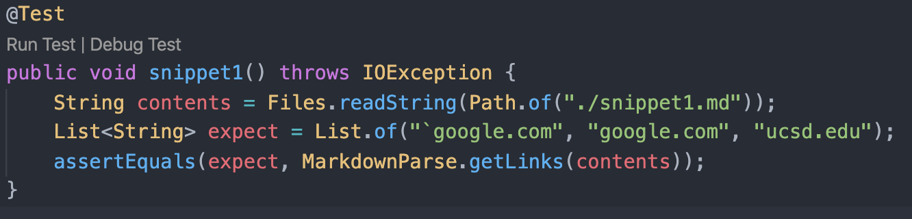
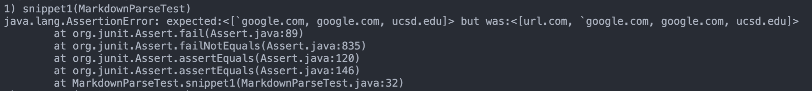
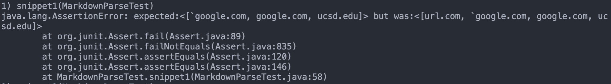
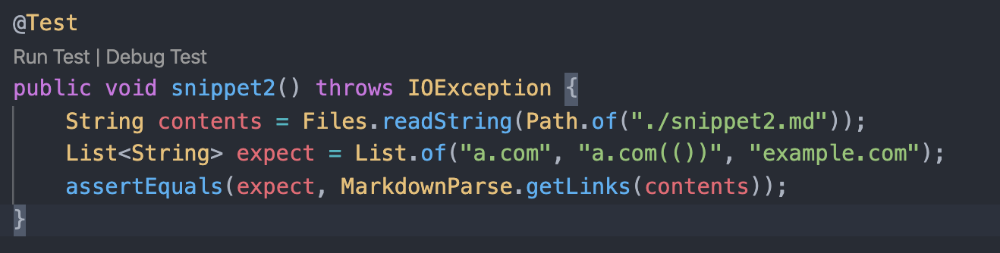
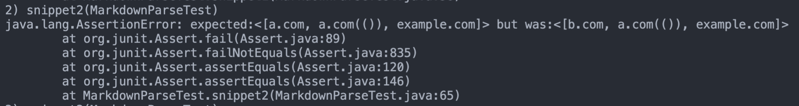
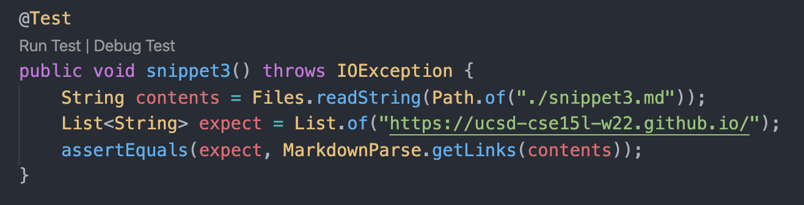
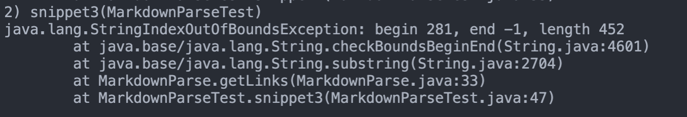
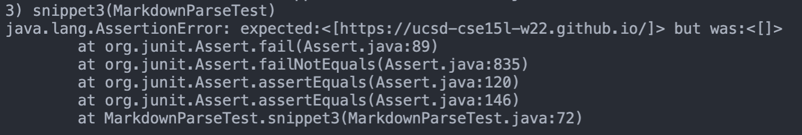

# Lab Report 4
## Links to repositories
[Link to my repository](https://github.com/parth4apple/markdown-parse)

[Link to repository I reviewed](https://github.com/atruong39/markdown-parse)

## Snippet 1
What the test should produce: ``["`google.com", "google.com", "ucsd.edu"]``

Code in MarkdownParseTest.java for how I turned it into a test:

My implementation's error from junit:

The implementation I reviewed's error from junit:

## Snippet 2
What the test should produce: `["a.com", "a.com(()), example.com"]`

Code in MarkdownParseTest.java for how I turned it into a test:

My implementation produces the expected output for snippet 2.

The implementation I reviewed's error from junit:

## Snippet 3
What the test should produce: `["https://ucsd-cse15l-w22.github.io/"]`

Code in MarkdownParseTest.java for how I turned it into a test:

My implementation's error from junit:

The implementation I reviewed's error from junit:

## Analysis on fixing my implementation
### Snippet 1
With my implementation, it would be a minor change to account for backticks. I just need to create something that keeps track of the next backtick and if there is another one, to ignore the text between the two when looking for links. This can be done with a simple while loop similar to the one that checks for valid parenthesis. 

### Snippet 2
My implementation works for the snippet 2, and should work for other cases where there are nested parenthesis or nested brackets as well, since I have a valid parenthesis checker.

### Snippet 3
My implementation would only require a small change (<10 lines) in order for it to work with line breaks like the ones present in snippet 3. I would need to check that currentIndex is not out of bounds and if it is, to terminate the loop. Also, I would need to add a `\n` checker to make sure that links containing that character are not added to the list. This should only take a few if statements for both tasks.

