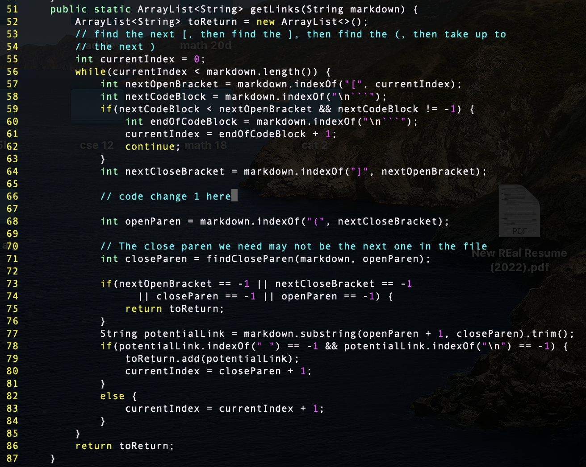
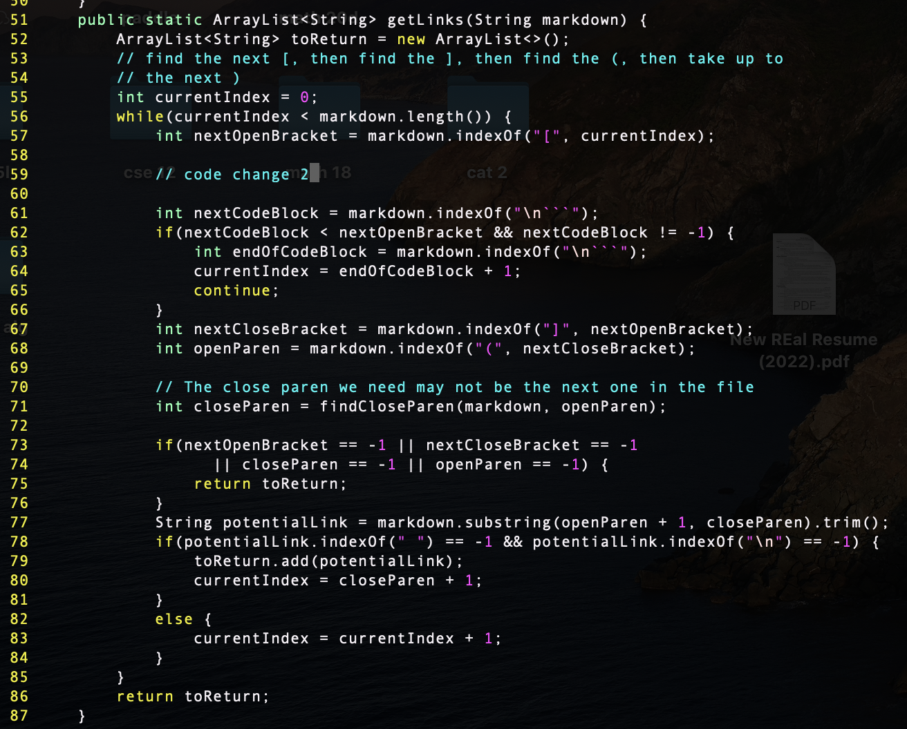

# Lab Report 5

## Test #1: `567.md`
In order to find this test with different results, I put `echo $file` into my `script.sh` so that I know what file each result corresponds to before generating my `results.txt`. I used `git diff, I ran diff cse15l-markdown-parse/results.txt markdown-parse/results.txt` to see there is a discrepancy on line 1040 between the implementations. I used vim with `:set number` (to see the line numbers) to see that the difference of output is in `test-files/567.md`.

`567.md` contents:

Both implementations are incorrect here. The actual outputs are shown here (given implementaion output is on top, my implementation output is on bottom).

The expected output is `[/url]`.

For the provided implementation, the problem is that it does not recognize links that are in the form `[foo]: /link` as links when they are valid links in markdown (in this case `/link` is a valid link). In order to fix this, we would need to add a check to see if the character immediately after a set of brackets is a `:`, and if it is to count the rest of that line as a potential link. There would have to be more if statements that they potential link would have to go through before it is counted as a valid link (check for spaces etc).

The getLinks method that takes in a string parameter needs to be fixed. An example location where the code could be fixed is line 66 since we already know the location of an open and close bracket at that point. This code change is an addition so there is no specific segment within the getLinks method that needs to be changed.

## Test #2: `577.md`
In order to find this test with different results, I put `echo $file` into my `script.sh` so that I know what file each result corresponds to before generating my `results.txt`. I used `git diff, I ran diff cse15l-markdown-parse/results.txt markdown-parse/results.txt` to see there is a discrepancy on line 1062 between the implementations. I used vim with `:set number` (to see the line numbers) to see that the difference of output is in `test-files/577.md`.

`577.md` contents:

The given implementation is incorrect here. The actual outputs are shown here (given implementaion output is on top, my implementation output is on bottom). 

The expected output is `[]` because `train.jpg` is not a link.

For the provided implementation, there is no code to check whether a link markdown tag has a `!` before it, which would make it an image and not a link in markdown. Therfore, it interprets this image references as a links, when that should not be the case, and there is nothing in the code to account for this. A fix that would solve this problem would be to check if there is a `!` character before a potential link and not adding it to the return arrayList if that is the case.

The getLinks method that takes in a string parameter needs to be fixed. It would have to be placed after we know there is an open bracket, so an instance to place it could be line 59, or later.
This code change is an addition so there is no specific segment within the getLinks method that needs to be changed.

