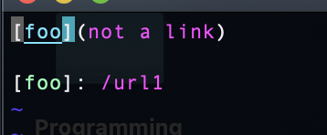
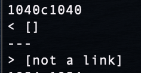
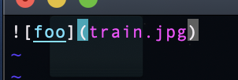
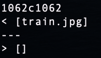

# Lab Report 5

## Test #1: `567.md`
In order to find this test with different results, I put `echo $file` into my `script.sh` so that I know what file each result corresponds to before generating my `results.txt`. I used `git diff, I ran diff cse15l-markdown-parse/results.txt markdown-parse/results.txt` to see there is a discrepancy on line 1040 between the implementations. I used vim with `:set number` (to see the line numbers) to see that the difference of output is in `test-files/567.md`.

`567.md` contents:

Both implementations are incorrect here. The actual outputs are shown here (given implementaion output is on top, my implementation output is on bottom).

The expected output is `[/url]`.

For the provided implementation, the problem is that it does not recognize links that are in the form `[foo]: /link` as links when they are valid links in markdown (in this case `/link` is a valid link). In order to fix this, we would need to add a check to see if the character immediately after a set of brackets is a `:`, and if it is to count the rest of that line as a potential link. There would have to be more if statements that they potential link would have to go through before it is counted as a valid link (check for spaces etc).

## Test #2: `577.md`
In order to find this test with different results, I put `echo $file` into my `script.sh` so that I know what file each result corresponds to before generating my `results.txt`. I used `git diff, I ran diff cse15l-markdown-parse/results.txt markdown-parse/results.txt` to see there is a discrepancy on line 1062 between the implementations. I used vim with `:set number` (to see the line numbers) to see that the difference of output is in `test-files/577.md`.

`577.md` contents:

The given implementation is incorrect here. The actual outputs are shown here (given implementaion output is on top, my implementation output is on bottom). 

The expected output is `[]` because `train.jpg` is not a link.

For the provided implementation, there is no code to check whether a link markdown tag has a `!` before it, which would make it an image and not a link in markdown. Therfore, it interprets this image references as a links, when that should not be the case, and there is nothing in the code to account for this. A fix that would solve this problem would be to check if there is a `!` character before a potential link and not adding it to the return arrayList if that is the case.

